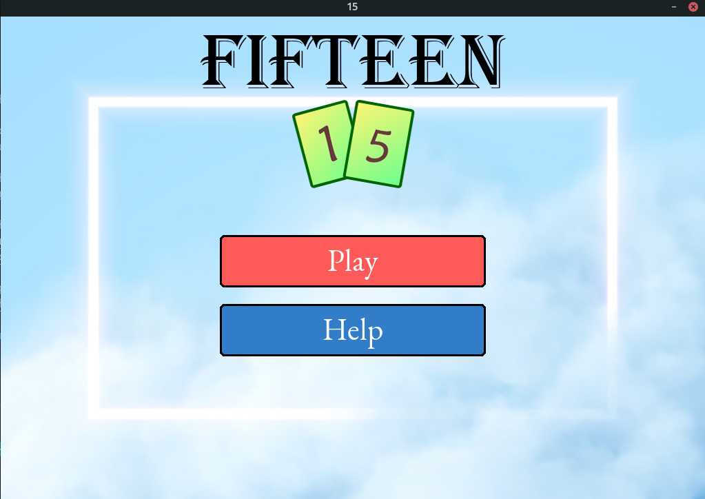
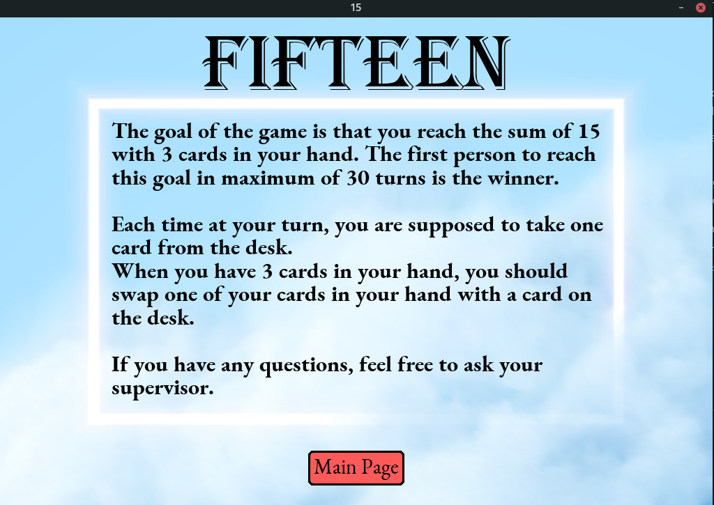
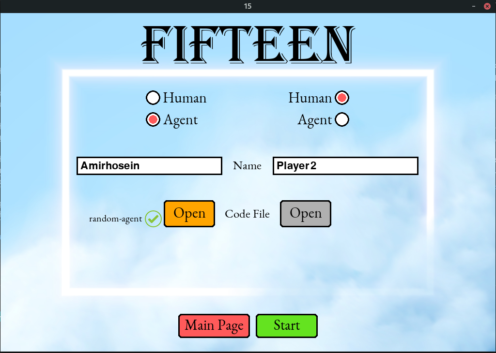
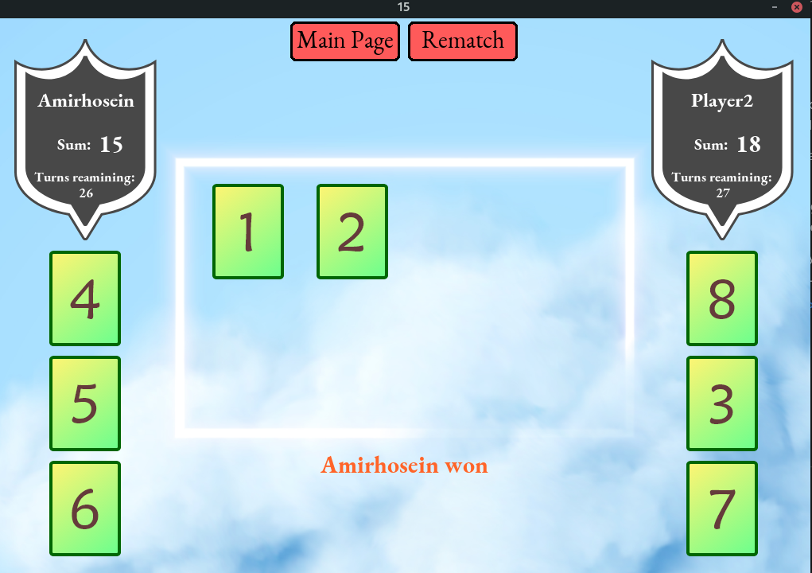

# Hour of Code Game

This is a 2-Player game which has 3 modes:

* Human vs Human
* Human vs Agent
* Agent vs Agent
  
A player has to draw or exchange cards from the board cards so that the sum of his/her 3 cards would be 15.

No one can have more than 3 cards in his/her hand, and a player must draw or exchange a card.

The main purpose of this game is that students have to write an agent with Python language, and compete with each other and brawl !

This game is developed by [Amirreza Ektesabi](https://github.com/ar-ekt/) (Game Design) and [Amirhosein Gharaati](https://github.com/AmirHosein-Gharaati/) (UI/UX design)

Special thanks to [ACM-ICPC association of Shiraz University](http://acm.shirazu.ac.ir/) for holding this ceremony

### Installation

    pip3 install -r requirements.txt

or 

you can install packages in requirements.txt manually

### Usage

Select your mode. If you want to test your agent, you can browse your python file and select it.

**Note**: your python code must have a function named "**main**" with 3 parameters (myCards, opponentCards, onBoardCards). Also your function should return 2 integers (a list with 2 integers) which the first one is selected-card and the second one is unselected-card (The second integer must be 0, if the agent has lower than 3 cards in its hand). If you see a X-red sign, that means your code does not meet these requirement or it has a bad logic !

**Note**: If your code crashes or does a foul move, you will lose immediately ! So be careful :)

### Screen Shots

### :')